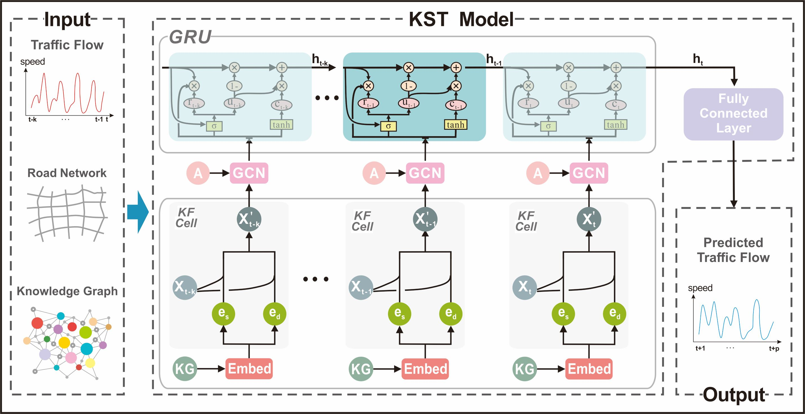

This is a TensorFlow implementation of KST-GCN: A Knowledge-Driven Spatial-Temporal Graph Convolutional Network for Traffic Forecasting

# The manuscript
## KST-GCN: A Knowledge-Driven Spatial-Temporal Graph Convolutional Network for Traffic Forecasting

While considering the spatial and temporal features of traffic, capturing the impacts of various external factors on travel is an essential step towards achieving accurate traffic forecasting. However, existing studies seldom consider external factors or neglect the effect of the complex correlations among external factors on traffic. Intuitively, knowledge graphs can naturally describe these correlations. Since knowledge graphs and traffic networks are essentially heterogeneous networks, it is challenging to integrate the information in both networks. On this background, this study presents a knowledge representation-driven traffic forecasting method based on spatial-temporal graph convolutional networks. We first construct a knowledge graph for traffic forecasting and derive knowledge representations by a knowledge representation learning method named KR-EAR. Then, we propose the Knowledge Fusion Cell (KF-Cell) to combine the knowledge and traffic features as the input of a spatial-temporal graph convolutional backbone network. Experimental results on the real-world dataset show that our strategy enhances the forecasting performances of backbones at various prediction horizons. The ablation and perturbation analysis further verify the effectiveness and robustness of the proposed method. To the best of our knowledge, this is the first study that constructs and utilizes a knowledge graph to facilitate traffic forecasting; it also offers a promising direction to integrate external information and spatial-temporal information for traffic forecasting.

If this repo is useful in your research, please kindly consider citing our paper as follow.
```
Bibtex
@article{zhu2022kst,
    title={KST-GCN: A Knowledge-Driven Spatial-Temporal Graph Convolutional Network for Traffic Forecasting},
    author={Zhu, Jiawei and Han, Xing and Deng, Hanhan and Tao, Chao and Zhao, Ling and Wang, Pu and Tao, Lin and Li, Haifeng},
    journal={IEEE Transactions on Intelligent Transportation Systems},
    DOI = {doi:10.109/TITS.2021.3136287},
    year={2021},
    type = {Journal Article}
}

. <c #19AD19>. IEEE Transactions on Intelligent Transportation Systems. 2021. 


Endnote
%0 Journal Article
%A Zhu, Jiawei
%A Han, Xing
%A Deng, Hanhan
%A Tao, Chao
%A Zhao, Ling
%A Wang, Pu
%A Lin, Tao
%A Li, Haifeng
%D 2021
%T KST-GCN: A Knowledge-Driven Spatial-Temporal Graph Convolutional Network for Traffic Forecasting
%B IEEE Transactions on Intelligent Transportation Systems
%R DOI:10.109/TITS.2021.3136287
%! KST-GCN: A Knowledge-Driven Spatial-Temporal Graph Convolutional Network for Traffic Forecasting
```

## Framework


The manuscript can be visited at https://ieeexplore.ieee.org/document/9681326/ or https://arxiv.org/abs/2011.14992.

