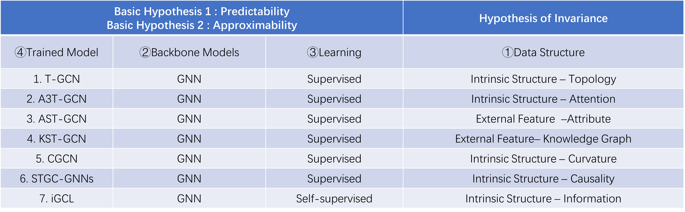

## Overview
This repository includes our works on Graph representation learning and its application on Traffic Flow Prediction.

The ideas behind our works can be abstracted and demonstrated in the following big picture. 

  

All works can be deduced, inspired and created from this picture.

  

The congruent relationships between Our works included in this repository and the big picture are listed in the following:

  

The file structure is listed as follows:

1 T-GCN is the source codes for the paper named “T-GCN: A Temporal Graph Convolutional Network for Traffic Prediction” published at IEEE Transactions on Intelligent Transportation Systems (T-ITS) which forged the T-GCN model model the spatial and temporal dependence simultaneously. 

2 A3T-GCN is the source codes for the paper named “A3T-GCN: Attention Temporal Graph Convolutional Network for Traffic Forecasting” published at ISPRS International Journal of Geo-Information which strengthen the T-GCN model model with attention structure.

3 AST-GCN is the source codes for the paper named “AST-GCN: Attribute-Augmented Spatiotemporal Graph Convolutional Network for Traffic Forecasting” published at  IEEE Access which strengthen the T-GCN model model with attribute information.

4 KST-GCN is the source codes for the paper named “KST-GCN: A Knowledge-Driven Spatial-Temporal Graph Convolutional Network for Traffic Forecasting” published at IEEE Transactions on Intelligent Transportation Systems (T-ITS) which  which strengthen the T-GCN model model with knowledge graph.

5 CGCN is the source codes for the paper named “Curvature graph neural network” published at Information Sciences which used ricci curvature information to model pivotal nodes. And STCGNN is the source codes for the paper named "Ollivier–Ricci Curvature Based Spatio-Temporal Graph Neural Networks for Traffic Flow Forecasting" which is a extension of CGCN in the filed of traffic forecasting.

6 STGC-GNNs is the source codes for the paper named "STGC-GNNs: A GNN-based traffic prediction framework with a spatial-temporal Granger causality graph" published at Physica A: Statistical Mechanics and its Applications. 

7 iGCL is the source codes for the paper named "Augmentation-Free Graph Contrastive Learning of Invariant-Discriminative Representations" published at IEEE Transactions on Neural Networks and Learning Systems.

8 Baseline includes methods such as (1) History Average model (HA) (2) Autoregressive Integrated Moving Average model (ARIMA) (3) Support Vector Regression model (SVR) (4) Graph Convolutional Network model (GCN) (5) Gated Recurrent Unit model (GRU)

## 1. T-GCN: A Temporal Graph Convolutional Network for Traffic Prediction
Accurate and real-time traffic forecasting plays an important role in the Intelligent Traffic System and is of great significance for urban traffic planning, traffic management, and traffic control. However, traffic forecasting has always been considered an open scientific issue, owing to the constraints of urban road network topological structure and the law of dynamic change with time, namely, spatial dependence and temporal dependence. To capture the spatial and temporal dependence simultaneously, we propose a novel neural network-based traffic forecasting method, the temporal graph convolutional network (T-GCN) model, which is in combination with the graph convolutional network (GCN) and gated recurrent unit (GRU). Specifically, the GCN is used to learn complex topological structures to capture spatial dependence and the gated recurrent unit is used to learn dynamic changes of traffic data to capture temporal dependence. Then, the T-GCN model is employed to traffic forecasting based on the urban road network. Experiments demonstrate that our T-GCN model can obtain the spatio-temporal correlation from traffic data and the predictions outperform state-of-art baselines on real-world traffic datasets.

The manuscript can be visited at https://ieeexplore.ieee.org/document/8809901 or https://arxiv.org/abs/1811.05320

[The code](https://github.com/lehaifeng/T-GCN/tree/master/T-GCN)

## 2. A3T-GCN: Attention Temporal Graph Convolutional Network for Traffic Forecasting
Accurate real-time traffic forecasting is a core technological problem against the implementation of the intelligent transportation system. However, it remains challenging considering the complex spatial and temporal dependencies among traffic flows. In the spatial dimension, due to the connectivity of the road network, the traffic flows between linked roads are closely related. In terms of the temporal factor, although there exists a tendency among adjacent time points in general, the importance of distant past points is not necessarily smaller than that of recent past points since traffic flows are also affected by external factors. In this study, an attention temporal graph convolutional network (A3T-GCN) traffic forecasting method was proposed to simultaneously capture global temporal dynamics and spatial correlations. The A3T-GCN model learns the short-time trend in time series by using the gated recurrent units and learns the spatial dependence based on the topology of the road network through the graph convolutional network. Moreover, the attention mechanism was introduced to adjust the importance of different time points and assemble global temporal information to improve prediction accuracy. Experimental results in real-world datasets demonstrate the effectiveness and robustness of proposed A3T-GCN.

The manuscript can be visited at https://www.mdpi.com/2220-9964/10/7/485/html or arxiv https://arxiv.org/abs/2006.11583.

[The code](https://github.com/lehaifeng/T-GCN/tree/master/A3T-GCN)

## 3. AST-GCN: Attribute-Augmented Spatiotemporal Graph Convolutional Network for Traffic Forecasting
Traffic forecasting is a fundamental and challenging task in the field of intelligent transportation. Accurate forecasting not only depends on the historical traffic flow information but also needs to consider the influence of a variety of external factors, such as weather conditions and surrounding POI distribution. Recently, spatiotemporal models integrating graph convolutional networks and recurrent neural networks have become traffic forecasting research hotspots and have made significant progress. However, few works integrate external factors. Therefore, based on the assumption that introducing external factors can enhance the spatiotemporal accuracy in predicting traffic and improving interpretability, we propose an attribute-augmented spatiotemporal graph convolutional network (AST-GCN). We model the external factors as dynamic attributes and static attributes and design an attribute-augmented unit to encode and integrate those factors into the spatiotemporal graph convolution model. Experiments on real datasets show the effectiveness of considering external information on traffic speed forecasting tasks when compared with traditional traffic prediction methods. Moreover, under different attribute-augmented schemes and prediction horizon settings, the forecasting accuracy of the AST-GCN is higher than that of the baselines.

The manuscript can be visited at https://ieeexplore.ieee.org/document/9363197 or https://arxiv.org/abs/2011.11004.

[The code](https://github.com/lehaifeng/T-GCN/tree/master/AST-GCN)

## 4. KST-GCN: A Knowledge-Driven Spatial-Temporal Graph Convolutional Network for Traffic Forecasting
While considering the spatial and temporal features of traffic, capturing the impacts of various external factors on travel is an essential step towards achieving accurate traffic forecasting. However, existing studies seldom consider external factors or neglect the effect of the complex correlations among external factors on traffic. Intuitively, knowledge graphs can naturally describe these correlations. Since knowledge graphs and traffic networks are essentially heterogeneous networks, it is challenging to integrate the information in both networks. On this background, this study presents a knowledge representation-driven traffic forecasting method based on spatial-temporal graph convolutional networks. We first construct a knowledge graph for traffic forecasting and derive knowledge representations by a knowledge representation learning method named KR-EAR. Then, we propose the Knowledge Fusion Cell (KF-Cell) to combine the knowledge and traffic features as the input of a spatial-temporal graph convolutional backbone network. Experimental results on the real-world dataset show that our strategy enhances the forecasting performances of backbones at various prediction horizons. The ablation and perturbation analysis further verify the effectiveness and robustness of the proposed method. To the best of our knowledge, this is the first study that constructs and utilizes a knowledge graph to facilitate traffic forecasting; it also offers a promising direction to integrate external information and spatial-temporal information for traffic forecasting.

The manuscript can be visited at https://ieeexplore.ieee.org/document/9681326/ or https://arxiv.org/abs/2011.14992.

[The code](https://github.com/lehaifeng/T-GCN/tree/master/KST-GCN)

## 5. Curvature graph neural network
Graph neural networks (GNNs) have achieved great success in many graph-based tasks. Much work is dedicated to empowering GNNs with adaptive locality ability, which enables the measurement of the importance of neighboring nodes to the target node by a node-specific mechanism. However, the current node-specific mechanisms are deficient in distinguishing the importance of nodes in the topology structure. We believe that the structural importance of neighboring nodes is closely related to their importance in aggregation. In this paper, we introduce discrete graph curvature (the Ricci curvature) to quantify the strength of the structural connection of pairwise nodes. We propose a curvature graph neural network (CGNN), which effectively improves the adaptive locality ability of GNNs by leveraging the structural properties of graph curvature. To improve the adaptability of curvature on various datasets, we explicitly transform curvature into the weights of neighboring nodes by the necessary negative curvature processing module and curvature normalization module. Then, we conduct numerous experiments on various synthetic and real-world datasets. The experimental results on synthetic datasets show that CGNN effectively exploits the topology structure information and that the performance is significantly improved. CGNN outperforms the baselines on 5 dense node classification benchmark datasets. This study provides a deepened understanding of how to utilize advanced topology information and assign the importance of neighboring nodes from the perspective of graph curvature and encourages bridging the gap between graph theory and neural networks. The source code is available at https://github.com/GeoX-Lab/CGNN.

The manuscript can be visited at https://www.sciencedirect.com/science/article/pii/S0020025521012986 or https://arxiv.org/abs/2106.15762.

The extension of CGNN in the filed of traffic prediction is Spatio-temporal Cruvature Graph Neural Network(STCGNN). The manuscript can be visited at https://www.mdpi.com/2073-8994/15/5/995. 

[The code](https://github.com/GeoX-Lab/STCGNN)

## 6.STGC-GNNs: A GNN-based traffic prediction framework with a spatial-temporal Granger causality graph
It is important to model the spatial dependence of the road network for traffic prediction tasks. The essence of spatial dependence is to accurately describe how traffic information transmission is affected by other nodes in the road network, and the GNN-based traffic prediction model, as a benchmark for traffic prediction, has become the most common method for the ability to model spatial dependence by transmitting traffic information with the message passing mechanism. However, the transmission of traffic information is a global and dynamic process in long-term traffic prediction, which cannot be described by the local and static spatial dependence. In this paper, we proposed a spatial-temporal Granger causality(STGC) to model the global and dynamic spatial dependence, which can capture a stable causal relationship between nodes underlying dynamic traffic flow. The STGC can be detected by a spatial-temporal Granger causality test methods proposed by us. We chose T-GCN, STGCN and Graph Wavenet as bakbones, and the experimental results on three backbone models show that using STGC to model the spatial dependence has better results than the original model for 45-min and 1 h long-term prediction. 

The manuscript can be visited at https://www.sciencedirect.com/science/article/abs/pii/S0378437123004685 or https://arxiv.org/abs/2210.16789.

[The code](https://github.com/lehaifeng/T-GCN/tree/master/STGC-GNN)

## 7. Augmentation-Free Graph Contrastive Learning of Invariant-Discriminative Representations
Graph contrastive learning is a promising direction toward alleviating the label dependence, poor generalization and weak robustness of graph neural networks, learning representations with invariance, and discriminability by solving pretasks. The pretasks are mainly built on mutual information estimation, which requires data augmentation to construct positive samples with similar semantics to learn invariant signals and negative samples with dissimilar semantics in order to empower representation discriminability. However, an appropriate data augmentation configuration depends heavily on lots of empirical trials such as choosing the compositions of data augmentation techniques and the corresponding hyperparameter settings. We propose an augmentation-free graph contrastive learning method, invariant-discriminative graph contrastive learning (iGCL), that does not intrinsically require negative samples. iGCL designs the invariant-discriminative loss (ID loss) to learn invariant and discriminative representations. On the one hand, ID loss learns invariant signals by directly minimizing the mean square error between the target samples and positive samples in the representation space. On the other hand, ID loss ensures that the representations are discriminative by an orthonormal constraint forcing the different dimensions of representations to be independent of each other. This prevents representations from collapsing to a point or subspace. Our theoretical analysis explains the effectiveness of ID loss from the perspectives of the redundancy reduction criterion, canonical correlation analysis, and information bottleneck principle. The experimental results demonstrate that iGCL outperforms all baselines on 5 node classification benchmark datasets. iGCL also shows superior performance for different label ratios and is capable of resisting graph attacks, which indicates that iGCL has excellent generalization and robustness. 

The manuscript can be visited at arxiv https://arxiv.org/abs/2210.08345 or https://ieeexplore.ieee.org/document/10058898.

[The code](https://github.com/lehaifeng/T-GCN/tree/master/iGCL)

## 8. High-Order Topology-Enhanced Graph Convolutional Networks (HoT-GCN) for Dynamic Graphs
Understanding the evolutionary mechanisms of dynamic graphs is crucial since dynamic is a basic characteristic of real-world networks. The challenges of modeling dynamic graphs are as follows: (1) Real-world dynamics are frequently characterized by group effects, which essentially emerge from high-order interactions involving groups of entities. Therefore, the pairwise interactions revealed by the edges of graphs are insufficient to describe complex systems. (2) The graph data obtained from real systems are often noisy, and the spurious edges can interfere with the stability and efficiency of models. To address these issues, we propose a high-order topology-enhanced graph convolutional network for modeling dynamic graphs. The rationale behind it is that the symmetric substructure in a graph, called the maximal clique, can reflect group impacts from high-order interactions on the one hand, while not being readily disturbed by spurious links on the other hand. Then, we utilize two independent branches to model the distinct influence mechanisms of the two effects. Learnable parameters are used to tune the relative importance of the two effects during the process. We conduct link predictions on real-world datasets, including one social network and two citation networks. Results show that the average improvements of the high-order enhanced methods are 68%, 15%, and 280% over the corresponding backbones across datasets. The ablation study and perturbation analysis validate the effectiveness and robustness of the proposed method. Our research reveals that high-order structures provide new perspectives for studying the dynamics of graphs and highlight the necessity of employing higher-order topologies in the future.

The manuscript can be visited at https://www.mdpi.com/2073-8994/14/10/2218.

[The code](https://github.com/lehaifeng/T-GCN/tree/master/HoT-GCN)

## 9. Alleviating neighbor bias: augmenting graph self-supervise learning with structural equivalent positive samples
In recent years, using a self-supervised learning framework to learn the general characteristics of graphs has been considered a promising paradigm for graph representation learning. The core of self-supervised learning strategies for graph neural networks lies in constructing suitable positive sample selection strategies. However, existing GNNs typically aggregate information from neighboring nodes to update node representations, leading to an over-reliance on neighboring positive samples, i.e., homophilous samples; while ignoring long-range positive samples, i.e., positive samples that are far apart on the graph but structurally equivalent samples, a problem we call "neighbor bias." This neighbor bias can reduce the generalization performance of GNNs. In this paper, we argue that the generalization properties of GNNs should be determined by combining homogeneous samples and structurally equivalent samples, which we call the "GC combination hypothesis." Therefore, we propose a topological signal-driven self-supervised method. It uses a topological information-guided structural equivalence sampling strategy. First, we extract multiscale topological features using persistent homology. Then we compute the structural equivalence of node pairs based on their topological features. In particular, we design a topological loss function to pull in non-neighboring node pairs with high structural equivalence in the representation space to alleviate neighbor bias. Finally, we use the joint training mechanism to adjust the effect of structural equivalence on the model to fit datasets with different characteristics. We conducted experiments on the node classification task across seven graph datasets. The results show that the model performance can be effectively improved using a strategy of topological signal enhancement.

The manuscript can be visited at arxiv https://arxiv.org/abs/2212.04365.

[The code](https://github.com/lehaifeng/T-GCN/tree/master/Sep-GCL)
