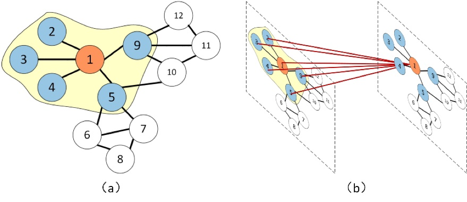
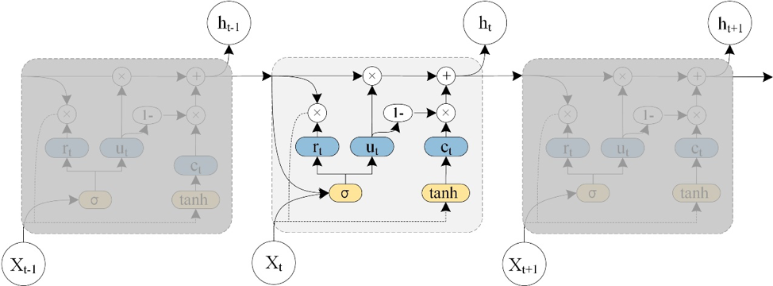
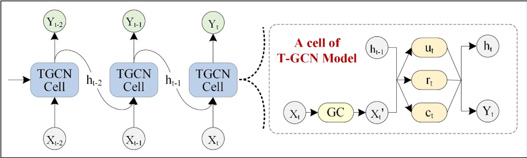

This is a TensorFlow implementation of T-GCN: A Temporal Graph Convolutional Network for Traffic Prediction.

# The manuscript
## T-GCN: A Temporal Graph Convolutional Network for Traffic Prediction

Accurate and real-time traffic forecasting plays an important role in the Intelligent Traffic System and is of great significance for urban traffic planning, traffic management, and traffic control. However, traffic forecasting has always been considered an open scientific issue, owing to the constraints of urban road network topological structure and the law of dynamic change with time, namely, spatial dependence and temporal dependence. To capture the spatial and temporal dependence simultaneously, we propose a novel neural network-based traffic forecasting method, the temporal graph convolutional network (T-GCN) model, which is in combination with the graph convolutional network (GCN) and gated recurrent unit (GRU). Specifically, the GCN is used to learn complex topological structures to capture spatial dependence and the gated recurrent unit is used to learn dynamic changes of traffic data to capture temporal dependence. Then, the T-GCN model is employed to traffic forecasting based on the urban road network. Experiments demonstrate that our T-GCN model can obtain the spatio-temporal correlation from traffic data and the predictions outperform state-of-art baselines on real-world traffic datasets. 

The manuscript can be visited at https://ieeexplore.ieee.org/document/8809901   or  https://arxiv.org/abs/1811.05320 

If this repo is useful in your research, please kindly consider citing our paper as follow.   
```
Bibtex
@article{zhao2019tgcn,
    title={T-GCN: A Temporal Graph Convolutional Network for Traffic Prediction},
    author={Zhao, Ling and Song, Yujiao and Zhang, Chao and Liu, Yu and Wang, Pu and Lin, Tao and Deng, Min and Li, Haifeng},
    journal={IEEE Transactions on Intelligent Transportation Systems},
    DOI = {10.1109/TITS.2019.2935152},
    year={2019},
    type = {Journal Article}
}

Endnote
%0 Journal Article
%A Zhao, Ling
%A Song, Yujiao
%A Zhang, Chao
%A Liu, Yu
%A Wang, Pu
%A Lin, Tao
%A Deng, Min
%A Li, Haifeng
%D 2019
%T T-GCN: A Temporal Graph Convolutional Network for Traffic Prediction
%B IEEE Transactions on Intelligent Transportation Systems
%R DOI:10.1109/TITS.2019.2935152
%! T-GCN: A Temporal Graph Convolutional Network for Traffic Prediction
```

GCN module:<br>



GRU module:<br>



T-GCN Cell:<br>



# The Code
## Requirements:
* tensorflow
* scipy
* numpy
* matplotlib
* pandas
* math

## Run the demo
Python main.py

Our baselines included: <br>
(1) History Average model (HA)<br>
(2) Autoregressive Integrated Moving Average model (ARIMA)<br>
(3) Support Vector Regression model (SVR)<br>
(4) Graph Convolutional Network model (GCN)<br>
(5) Gated Recurrent Unit model (GRU)<br>

The python implementations of HA/ARIMA/SVR models were in the baselines.py; The GCN and GRU models were in gcn.py and gru.py respective.


The T-GCN model was in the tgcn.py


## Implement
In this paper, we set time interval as 15 minutes, 30 minutes, 45 minutes and 60 minutes.

In the sz_taxi dataset, we set the parameters seq_len to 4 and pre_len to 1, 2, 3, 4; In the los_loop dataset, we set the parameters seq_len 12 and the pre_len to 3, 6, 9, 12 respectively.

## Data Description
There are two datasets in the data fold.<br>
(1) SZ-taxi. This dataset was the taxi trajectory of Shenzhen from Jan. 1 to Jan. 31, 2015. We selected 156 major roads of Luohu District as the study area.<br>
(2) Los-loop. This dataset was collected in the highway of Los Angeles County in real time by loop detectors. We selected 207 sensors and its traffic speed from Mar.1 to Mar.7, 2012

In order to use the model, we need
* A N by N adjacency matrix, which describes the spatial relationship between roads, 
* A N by D feature matrix, which describes the speed change over time on the roads.

